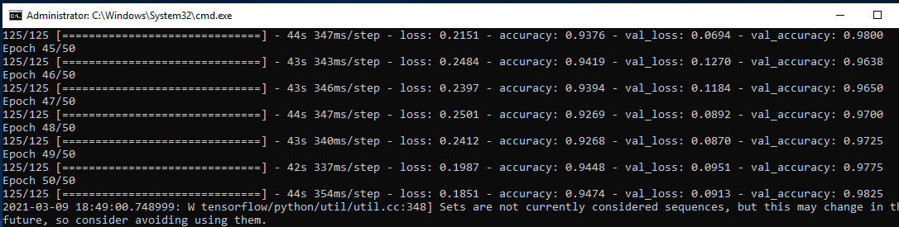
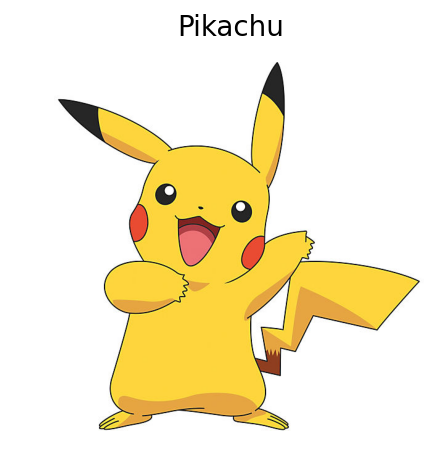

<!--
repo name: Keras-Testing
description: Project to play with Keras ML
github name:  BertilBraun
link: https://github.com/BertilBraun/Keras-Testing
logo path: assets/logo.jpg
screenshot: 
email: bertil.braun.private@gmail.com
-->

<!-- PROJECT SHIELDS -->
[![Contributors][contributors-shield]][contributors-url]
[![Forks][forks-shield]][forks-url]
[![Stargazers][stars-shield]][stars-url]
[![Issues][issues-shield]][issues-url]

<!-- PROJECT LOGO -->
 

    
<h3 align="center"><a href="https://github.com/BertilBraun/Keras-Testing">Keras-Testing</a></h3>
    

        An awesome project to get to know Keras and ML
         
         
        <a href="//github.com/Md-Template/ BertilBraun">View Demo</a>
        •
        <a href="https://github.com/BertilBraun/Keras-Testing/issues">Report Bug</a>
        •
        <a href="https://github.com/BertilBraun/Keras-Testing/issues">Request Feature</a>
    

<!-- TABLE OF CONTENTS -->
## Table of Contents

- [Table of Contents](#table-of-contents)
- [About The Project](#about-the-project)
- [Built With](#built-with)
  - [Model](#model)
- [Getting Started](#getting-started)
- [Usage](#usage)
- [Roadmap](#roadmap)
- [Contributing](#contributing)
- [License](#license)
- [Contact](#contact)

<!-- ABOUT THE PROJECT -->
## About The Project

Machine learing is an important part of the Future of developers. Therefore one should aspire to learn about it.
This repo is doing exactly that, setting up a simple enviroment to learn about different Models, Layers, Losses, Parameters etc. Basically learing to use Keras as a Black Box.
If you aspire to learn about the inner workings of Neuronal Networks, I am planning to read into that aswell in the soon future.

For now this project implements the simple starter project, using the mnist dataset to classify hand written digits on the [mnist branch](https://github.com/BertilBraun/Keras-Testing/tree/Mnist).

And on the main branch a pokemon classifier. A convolutional Neuronal Network trained from scratch to classify [these](https://github.com/BertilBraun/Keras-Testing/tree/main/PokemonData) 150 different kind of pokemons.

## Built With

- Keras / Tensorflow
- Matplotlib
- Numpy

### Model
Model: "sequential"
_________________________________________________________________
| Layer (type) | Output Shape         | Param   |
| ------------ | -------------------- | ------- |
| Conv2D       | (None, 150, 150, 32) | 896     |
| MaxPooling2D | (None, 75, 75, 32)   | 0       |
| Conv2D       | (None, 75, 75, 64)   | 18496   |
| MaxPooling2  | (None, 37, 37, 64)   | 0       |
| Conv2D       | (None, 35, 35, 64)   | 36928   |
| Activation   | (None, 35, 35, 64)   | 0       |
| MaxPooling2  | (None, 17, 17, 64)   | 0       |
| Flatten      | (None, 18496)        | 0       |
| Dense        | (None, 150)          | 2774550 |
_________________________________________________________________
| Parameters            | Count     |
| --------------------- | --------- |
| Total params:         | 2,830,870 |
| Trainable params:     | 2,830,870 |
| Non-trainable params: | 0         |
_________________________________________________________________

Found 6820 images belonging to 150 classes.

<!-- GETTING STARTED -->
## Getting Started

- clone this repo with `https://github.com/BertilBraun/Keras-Testing.git`
- install dependencies with `pip install -r requirements.txt`
- either train the model again with `python ./training.py`
- or test it out directly using `python ./test.py`

<!-- USAGE EXAMPLES -->
## Usage

A Machine learning Model to Classify Pokemon :)

- Download a nice clean Pokemon image
- Run `python ./test.py`
- Input your image path and see the prediced name

Currently limited to the ones listed [here](https://github.com/BertilBraun/Keras-Testing/tree/main/PokemonData).

<!-- ROADMAP -->
## Roadmap

See the [open issues](https://github.com/BertilBraun/Keras-Testing/issues) for a list of proposed features (and known issues).

- Host the project on something like Heroku for web access
- Proper GUI

<!-- CONTRIBUTING -->
## Contributing

Contributions are what make the open source community such an amazing place to be learn, inspire, and create. Any contributions you make are **greatly appreciated**.

1. Fork the Project
2. Create your Feature Branch (`git checkout -b feature/AmazingFeature`)
3. Commit your Changes (`git commit -m 'Add some AmazingFeature'`)
4. Push to the Branch (`git push origin feature/AmazingFeature`)
5. Open a Pull Request

<!-- LICENSE -->
## License

Distributed under the MIT License.

<!-- CONTACT -->
## Contact

Bertil Braun - bertil.braun.private@gmail.com

Project Link: [github.com/bertilbraun/keras-testing](https://github.com/BertilBraun/Keras-Testing)

<!-- MARKDOWN LINKS & IMAGES -->
<!-- https://www.markdownguide.org/basic-syntax/#reference-style-links -->
[contributors-shield]: https://img.shields.io/github/contributors/BertilBraun/Keras-Testing.svg?style=flat-square
[contributors-url]: https://github.com/BertilBraun/Keras-Testing/graphs/contributors
[forks-shield]: https://img.shields.io/github/forks/BertilBraun/Keras-Testing.svg?style=flat-square
[forks-url]: https://github.com/BertilBraun/Keras-Testing/network/members
[stars-shield]: https://img.shields.io/github/stars/BertilBraun/Keras-Testing.svg?style=flat-square
[stars-url]: https://github.com/BertilBraun/Keras-Testing/stargazers
[issues-shield]: https://img.shields.io/github/issues/BertilBraun/Keras-Testing.svg?style=flat-square
[issues-url]: https://github.com/BertilBraun/Keras-Testing/issues
[license-shield]: https://img.shields.io/github/license/BertilBraun/Keras-Testing.svg?style=flat-square
